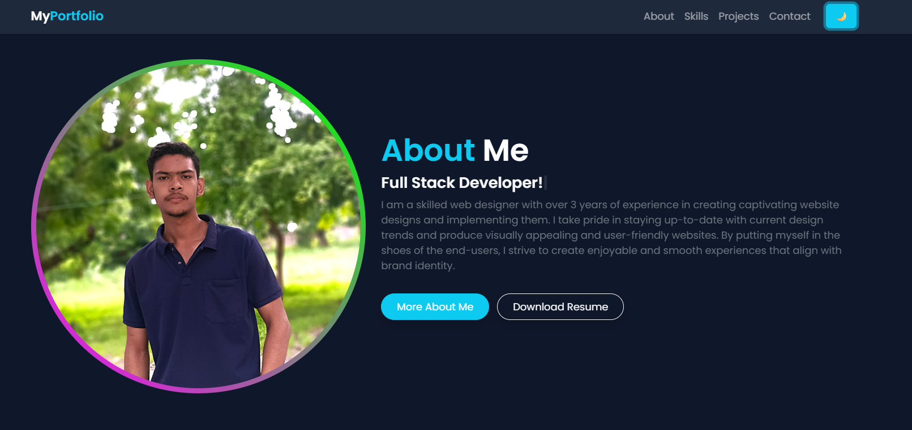

# 🌐 Personal Portfolio Website

A fully responsive and animated personal portfolio website built with **HTML**, **CSS**, and **JavaScript**, showcasing skills, projects, and a professional contact form — perfect for developers who want to display their work online with style and interactivity.

---

## 🔥 Features

- 🌙 Dark/Light Mode Toggle
- 📈 Scroll-activated Animated Skill Bars
- 🎨 Glowing Hover Effects on Profile & Projects
- 🧠 Typewriter Text Animation
- 🎬 Smooth Section Animations (Fade & Slide)
- 📬 Responsive Contact Form with Custom Styling
- 💻 Mobile-Friendly using Bootstrap 5

---

## 🚀 Live Demo

👉 [View Live Site](https://myportfolio-99.netlify.app/)  
*(Replace with your Netlify/Vercel/GitHub Pages URL)*

---

## 📷 Preview

  

---

## 📁 File Structure

/myportfolio-project
│
├── index.html
├── style.css
├── script.js
├── /images
│ ├── profile.jpg
│ ├── project1.jpg
│ └── project2.jpg
└── README.md
